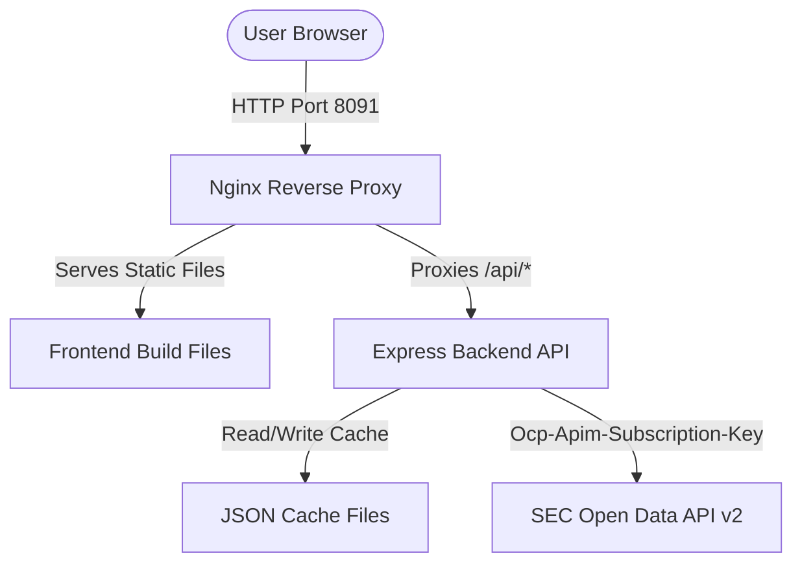
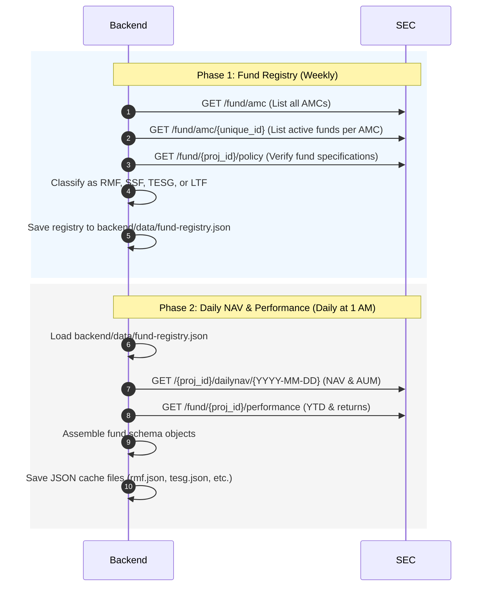

# Architecture

High-level architecture, components, and data flows of the SarnFund system.

## Components

The system is structured as a multi-container Docker Compose application consisting of three main services:

- **Frontend Builder (Vite + React)**: A one-shot node:22-alpine service that builds the frontend React single-page application (SPA) using Vite and outputs static files to a shared volume (`frontend_dist`). It exits cleanly once compilation completes.
- **Nginx Gateway (Reverse Proxy)**: Acts as the single entry point (port 8091). Serves the compiled static frontend files and proxies API requests `/api/*` to the backend Express server. Includes gzip compression and client-side caching configurations.
- **Backend Service (Node.js + Express)**: An internal Express API server running on port 3001 (not exposed directly to the host). It serves the cached fund data, runs a daily cron job at 1:00 AM to fetch NAV updates, and provides a protected endpoint to trigger manual scrapes.
- **SEC Thailand Open Data API v2**: The official external API endpoints (`api.sec.or.th`) from which the backend gathers all mutual fund data.

## Data Flow & Scraping Pipeline

To minimize API rate limiting and avoid redundant fetches, SarnFund implements a **two-phase data pipeline**:

### 1. Phase 1 — Fund Registry Build (Weekly)
- **TTL**: 7 days.
- **Purpose**: Dynamically maps and classifies active funds from 18 AMCs into their respective tax-saving categories: RMF, SSF, ThaiESG (TESG), or LTF.
- **Mechanism**:
  1. Requests all AMCs and filters against the target map of 18 companies.
  2. Queries all active (`RG`) funds for each AMC.
  3. Queries the policy details for each active fund in batches of 5.
  4. Matches against the fund types using keywords (e.g., `THAI_ESG`, `TESG`, `SSF`, `RMF`, `LTF`).
  5. Caches the result in `backend/data/fund-registry.json`.

### 2. Phase 2 — Daily NAV Fetch (Daily)
- **TTL**: 24 hours (run automatically by backend cron job daily at 01:00 AM server time).
- **Purpose**: Fetches daily Net Asset Value (NAV), Day-over-Day Changes, Assets Under Management (AUM), offering/redemption prices, and YTD performance.
- **Mechanism**:
  1. Reads `backend/data/fund-registry.json`.
  2. For each registered fund, queries the latest daily NAV (trying today, yesterday, and up to 5 days back to handle weekends and holidays).
  3. Queries performance statistics (YTD, 3M, 6M, 1Y, 3Y, 5Y).
  4. Assembles standard fund schema JSON files and saves them to `backend/data/` (e.g. `rmf.json`, `tesg.json`, `ssf.json`, `ltf.json`, `all.json`).

## Local Storage & Cache Synchronization

The React frontend utilizes a custom `useFundData` hook to maximize performance and deliver a smooth user experience:
1. **Instant Render**: On page load, the frontend checks `localStorage` for cached data. If the cache is less than 24 hours old, it renders the data immediately.
2. **Background Fetch**: It concurrently triggers a silent background API request to the Nginx gateway.
3. **Timestamp Verification**: When the backend response returns, the frontend checks if the backend timestamp is newer than the local storage version. It only updates the React state if the server's data is more recent, preventing stale asynchronous requests from overwriting updated UI states.

## Timezone Alignment

The SEC Thailand API is aligned with the Thailand stock market hours. To avoid midnight off-by-one errors when querying daily NAV dates, the backend utilizes `thaiDateStr(daysAgo)`, which offsets the server's timezone by UTC+7 before converting to `YYYY-MM-DD` formatting.
