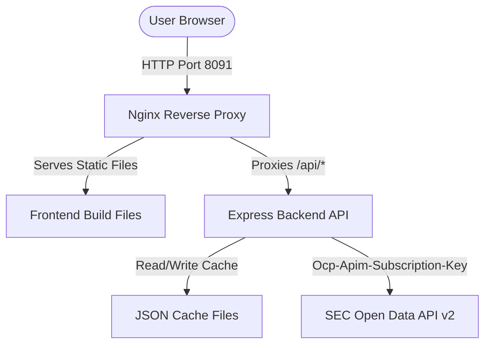
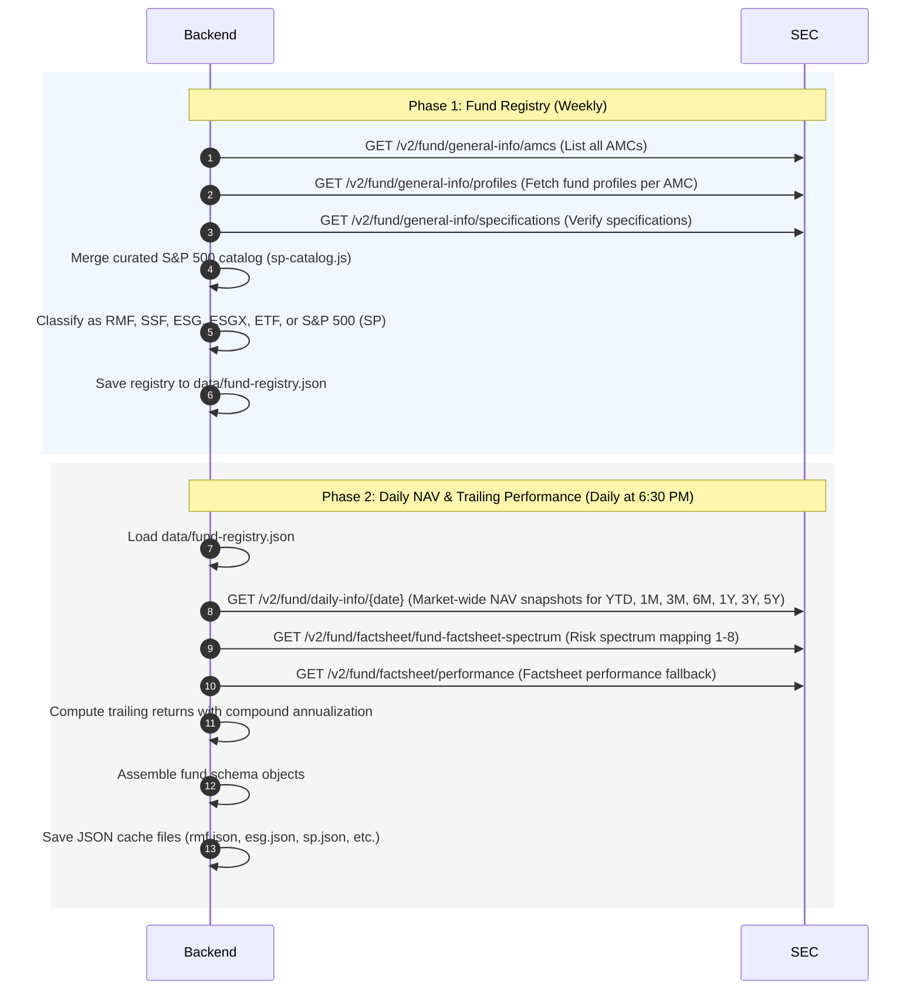

# Architecture

High-level architecture, components, and data flows of the SarnFund system.

## Components

The system is structured as a multi-container Docker Compose application consisting of three main services:

- **Frontend Builder (Vite + React)**: A one-shot node:24-alpine service that builds the frontend React single-page application (SPA) using Vite and outputs static files to a shared volume (`frontend_dist`). It exits cleanly once compilation completes.
- **Nginx Gateway (Reverse Proxy)**: Acts as the single entry point (port 8091). Serves the compiled static frontend files and proxies API requests `/api/*` to the backend Express server. Includes gzip compression and client-side caching configurations.
- **Backend Service (Node.js + Express)**: An internal Express API server running on port 3001 (not exposed directly to the host). It serves the cached fund data, runs a daily cron job at 6:30 PM to fetch NAV updates, and provides a protected endpoint to trigger manual scrapes.
- **SEC Thailand Open Data API v2**: The official external API endpoints (`api.sec.or.th`) from which the backend gathers all mutual fund data.

```mermaid
graph TD
    User([User Browser]) -->|HTTP Port 8091| Nginx[Nginx Reverse Proxy]
    Nginx -->|Serves Static Files| Frontend[Frontend Build Files]
    Nginx -->|Proxies /api/*| Backend[Express Backend API]
    Backend -->|Read/Write Cache| JSON[JSON Cache Files]
    Backend -->|Ocp-Apim-Subscription-Key| SEC[SEC Open Data API v2]
```

## Data Flow & Scraping Pipeline

To minimize API rate limiting and avoid redundant fetches, SarnFund implements a **two-phase data pipeline**:

```mermaid
sequenceDiagram
    autonumber
    rect rgb(240, 248, 255)
    Note over Backend, SEC: Phase 1: Fund Registry (Weekly)
    Backend->>SEC: GET /v2/fund/general-info/amcs (List all AMCs)
    Backend->>SEC: GET /v2/fund/general-info/profiles (Fetch fund profiles per AMC)
    Backend->>SEC: GET /v2/fund/general-info/specifications (Verify specifications)
    Backend->>Backend: Merge curated S&P 500 catalog (sp-catalog.js)
    Backend->>Backend: Classify as RMF, SSF, ESG, ESGX, ETF, or S&P 500 (SP)
    Backend->>Backend: Save registry to data/fund-registry.json
    end
    
    rect rgb(245, 245, 245)
    Note over Backend, SEC: Phase 2: Daily NAV & Trailing Performance (Daily at 6:30 PM)
    Backend->>Backend: Load data/fund-registry.json
    Backend->>SEC: GET /v2/fund/daily-info/{date} (Market-wide NAV snapshots for YTD, 1M, 3M, 6M, 1Y, 3Y, 5Y)
    Backend->>SEC: GET /v2/fund/factsheet/fund-factsheet-spectrum (Risk spectrum mapping 1-8)
    Backend->>SEC: GET /v2/fund/factsheet/performance (Factsheet performance fallback)
    Backend->>Backend: Compute trailing returns with compound annualization
    Backend->>Backend: Assemble fund schema objects
    Backend->>Backend: Save JSON cache files (rmf.json, esg.json, sp.json, etc.)
    end
```

### 1. Phase 1 — Fund Registry Build (Weekly)
- **TTL**: 7 days.
- **Purpose**: Dynamically maps and classifies active funds from 19 AMCs into their respective categories: RMF, SSF, ESG (ThaiESG), ESGX, ETF, or S&P 500 (SP).
- **Mechanism**:
  1. Requests all AMCs and filters against the target map of 19 companies (including AIA IM).
  2. Queries all active (`Registered` / `IPO`) fund profiles for each AMC.
  3. Detects SSF and ESG/ESGX tax incentives from the profile fields.
  4. For remaining profiles, queries specification details in batches of 5 to detect RMF or ETF types, and merges the curated S&P 500 funds catalog (`backend/sp-catalog.js`).
  5. Caches the deduplicated result in `data/fund-registry.json`.

### 2. Phase 2 — Daily NAV & Trailing Performance Engine (Daily)
- **TTL**: 24 hours (run automatically by backend cron job daily at 06:30 PM server time).
- **Purpose**: Fetches daily Net Asset Value (NAV), Assets Under Management (AUM), offering/redemption prices, SEC risk spectrum tiers, and calculates trailing returns (YTD, 1M, 3M, 6M, 1Y, 3Y, 5Y).
- **Mechanism**:
  1. Reads `data/fund-registry.json`.
  2. Queries the latest daily NAV for each fund (probing today, yesterday, and up to 5 days back to handle weekends and market holidays).
  3. Pre-fetches historical benchmark daily NAV snapshots across the entire market (`getBenchmarkNavMaps`) for target dates: YTD start (Dec 30/31 of previous year), 1M, 3M, 6M, 1Y, 3Y, and 5Y ago.
  4. Calculates trailing returns:
     - **<= 1 Year** (YTD, 1M, 3M, 6M, 1Y): Simple percentage return: `((currentNav - pastNav) / pastNav) * 100`.
     - **> 1 Year** (3Y, 5Y): Compound annualized return: `(((1 + r)^(1 / years)) - 1) * 100`.
     - **Fallback**: Merges with `/v2/fund/factsheet/performance` (`ผลตอบแทนกองทุนรวม`) when available.
  5. Resolves risk levels via `/v2/fund/factsheet/fund-factsheet-spectrum` (`getRiskSpectrum`), mapping official SEC risk tiers 1–8 (`risk_spectrum`) if the profile risk level is unpopulated.
  6. Assembles standard fund schema JSON files and saves them to the data directory (e.g. `rmf.json`, `esg.json`, `ssf.json`, `esgx.json`, `etf.json`, `sp.json`, `all.json`).

### 3. Catalog Retention & Resilience Invariant (Zero-Purge Policy)
- **Zero-Purge Guarantee**: Registered funds from `data/fund-registry.json` must **never be discarded** from category datasets, even when upstream SEC API endpoints return HTTP 204 No Content, empty daily NAV, or when market holidays/downtime occur.
- **Graceful Fallback Records**: If live NAV is unavailable, the scraper preserves prior cached NAV from `previousFundMap`. If no cache exists, it constructs a fallback record (`nav: null`, `navDate: null`, `navUnavailable: true`, complete AMC display name, factsheet URL, risk tier, and class) so the fund remains visible and searchable in the catalog.
- **Frontend Safe Rendering**: Tables (`FundTable.jsx`), KPI cards (`KPICards.jsx`), and charts (`FundChart.jsx`) handle `nav: null` gracefully: metrics display `'—'`, dates display `'Date unavailable'`, and return-based rankings filter out unpriced funds without runtime errors or layout distortion.
- **Destructive Write Guard**: The scraper explicitly aborts writing output files if 0 funds succeed and failures occur while no valid cache exists, preventing accidental overwrite of healthy fund datasets.
- **Authoritative Baseline Seed Parity**: `backend/seed-data.js` maintains exact 1-to-1 parity with all 794 registered funds in `data/fund-registry.json` (RMF: 379, SSF: 299, ESG: 38, ESGX: 34, ETF: 11, SP: 33). This guarantees that initializing an empty environment (`npm run init`) seeds the entire multi-category catalog without dropping funds.

## Local Storage & Cache Synchronization

The React frontend utilizes a custom `useFundData` hook to maximize performance and deliver a smooth user experience:
1. **Instant Render**: On page load, the frontend checks `localStorage` for cached data. If the cache is less than 24 hours old, it renders the data immediately.
2. **Background Fetch**: It concurrently triggers a silent background API request to the Nginx gateway.
3. **Timestamp Verification**: When the backend response returns, the frontend checks if the backend timestamp is newer than the local storage version. It only updates the React state if the server's data is more recent, preventing stale asynchronous requests from overwriting updated UI states.

## Timezone Alignment

The SEC Thailand API is aligned with the Thailand stock market hours. To avoid midnight off-by-one errors when querying daily NAV dates, the backend utilizes `thaiDateStr(daysAgo)`, which offsets the server's timezone by UTC+7 before converting to `YYYY-MM-DD` formatting.
